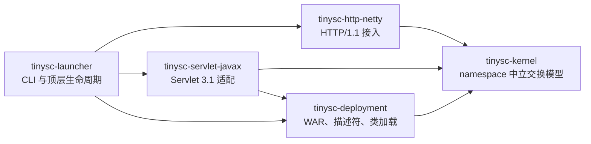
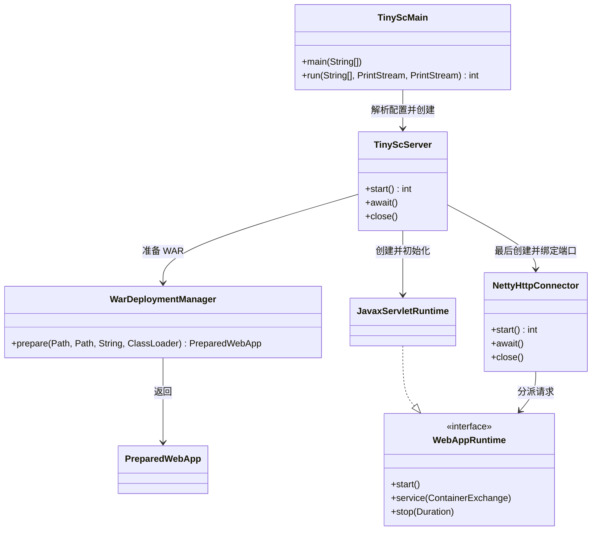
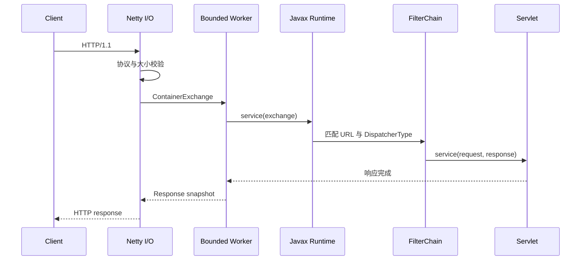

# tinysc 1.x 总体架构

## 1. 目标

tinysc 1.x 是 Java 8、Servlet 3.1、`javax.servlet` 的单应用容器。一个进程只运行一个
WAR，以较少的层级提供 HTTP 接入、WAR 部署、Servlet 生命周期、会话和运维能力。

当前阶段是 alpha。生产级兼容性的完成标准不是“WAR 能解压”，而是两个真实项目能够启动、
访问，并与 Tomcat 8 的关键行为完成差分验证。

## 2. 边界

### 必须提供

- HTTP/1.1 请求接入及有界资源控制。
- WAR 与 exploded directory 部署；挂载 `WEB-INF/lib` Resource JAR，并保持 Web 根优先。
- `web.xml 3.0/3.1`、Servlet、Filter、Listener、SCI。
- Session、Dispatch、同步 `web.xml` error-page、Async 与 Servlet 3.1 非阻塞 I/O。
- 单进程单 WAR 的启动、优雅停止和健康状态。
- Java 8 字节码和 `javax.servlet` namespace 不变。

### 1.0 不包含

- 多 Host、多 WAR、AJP、远程管理后台和自动热部署。
- 集群 Session、Session 持久化和应用代码沙箱。
- JSP 内置支持；JSP 以后作为独立可选模块评估。
- 已提交响应恢复、Async error dispatch、JSP error page 和完整 Servlet 3.1 / TCK 语义。

## 3. 模块



模块全部放在仓库 `src/` 下；模块内部继续采用 Maven 标准目录。

| 模块 | 职责 | 禁止事项 |
|---|---|---|
| `tinysc-kernel` | 生命周期、请求交换、响应模型、运行时接口 | 依赖任何 Servlet API |
| `tinysc-deployment` | 安全展开、描述符模型、类加载、检查 | 执行 Servlet 语义 |
| `tinysc-http-netty` | 网络、HTTP codec、限额、工作线程交接 | 运行应用代码于 I/O 线程 |
| `tinysc-servlet-javax` | Servlet 3.1 facade、映射、链和 Session | 引入 Jakarta namespace |
| `tinysc-launcher` | CLI、配置、组件组装、进程生命周期 | 包含业务专用分支 |

## 4. 启动事务

### 源码级启动类图



启动入口是 `TinyScMain`。它解析 `start` 参数并安装启动日志，然后由 `TinyScServer.start()` 依次
准备 WAR、启动 `JavaxServletRuntime`，最后调用 `NettyHttpConnector.start()`。真正的 socket 监听
发生在 `NettyHttpConnector` 的 `ServerBootstrap.bind(...)`；它排在 Listener、Filter 和
load-on-startup Servlet 初始化之后，因此日志出现 `tinysc ready` 时应用才开始对外接流量。

```text
读取配置
→ 检查 WAR/namespace/Java 字节码
→ 安全展开到 work staging
→ 解析部署元数据并创建 WebAppClassLoader
→ SCI、Listener、Filter、load-on-startup Servlet
→ 原子发布 ActiveApplication
→ 绑定并开放 HTTP 流量
```

任一步失败都必须逆序清理已创建资源，且应用不得进入可路由状态。

## 5. 请求链路



应用 Filter、Servlet、Listener 永远不在 Netty I/O 线程执行。工作队列满时返回 503，
不能无限排队。

源码中的关键交接点是：Netty pipeline 完成协议、超时、raw ingress 和聚合校验后，
`RequestHandler.channelRead0(...)` 取得请求准入 lease，并将任务提交给 `BoundedElasticExecutor`；
worker 构造 `ContainerRequest` / `ContainerResponse` / `ContainerExchange` 后调用
`JavaxServletRuntime.service(...)`。运行时先用 `ServletMapper` 找到 Servlet，再按 URL、Servlet 名称和
`DispatcherType` 组装 Filter 链，最后由 `ApplicationFilterChain` 调用目标 `Servlet.service(...)`。
响应快照回到 Netty event loop 写出；完成、超时、断连和拒绝路径都必须释放对应的连接、请求与字节
额度。

当目标 Servlet 通过 `web.xml`、SCI 或 `@MultipartConfig` 配置 multipart 时，`getPart(s)` 才按需
进入有界解析器。Servlet holder 在首次映射请求时懒解析并缓存注解；XML/SCI 显式配置整体优先，
不做字段级合并，也不扫描整个 WAR。
解析器从 `ContainerRequest.bodyStream()` 读取现有聚合 body，执行请求、文件、Part 数和 Part Header
限额，阈值以上内容写入 ServletContext 临时目录，并在同步请求结束或 Async 真正完成后删除。
这条路径没有额外复制整份 body，但传输层仍会先完整聚合，因此当前不是流式上传。

同步 error-page 走的是同一类受控缓冲重写。`sendError(...)` 和未捕获异常只会在响应尚未把 bytes
写到网络时进入 error dispatch；`setStatus(...)` 本身不会触发。TinySC 会按 exact status、异常最近
superclass、`ServletException` outer exception 再 root cause、status `500` 和 default error-page 的顺序
选页，进入自定义错误页时设置标准 `RequestDispatcher.ERROR_*` 属性、只匹配 `DispatcherType.ERROR`
的 Filter，并清掉旧 body 与 `Content-Length`，同时恢复原始 `Content-Type`。错误页失败时只回退一次
安全 `500`，不递归选择。

单 WAR 默认创建 `min(4, CPU)` 个 I/O 线程；阻塞业务代码进入独立、有界的 worker 池。两者都可在启动
参数中明确设置，性能报告必须记录实际值。

## 6. 类加载

```text
Bootstrap / Platform
        ↓
Container ClassLoader
        ↓
WebAppClassLoader
```

`java.*`、`javax.servlet.*` 和 `io.tinysc.*` 父优先且不可由 WAR 覆盖；应用依赖默认
`WEB-INF/classes → WEB-INF/lib → parent`。每次应用回调前设置 WebApp TCCL，并在
`finally` 中恢复。

关闭时先给应用后台任务一个短排空窗口，再关闭已识别的 Log4j2 LoggerContext；仍存活的
WebApp TCCL 线程会被中断并告警。容器不会使用已废弃的 `Thread.stop()`。

## 7. 非功能要求

| 类别 | 1.0 门禁 |
|---|---|
| Java | 在 Java 8 运行；发布 class major 不高于 52 |
| 资源 | 请求行、Header、body、队列、连接、Session 均有界 |
| 安全 | 防请求走私、路径穿越、Zip Slip、XXE、响应头注入 |
| 可运维 | 结构化启动日志、访问日志、live/ready、优雅停止 |
| 兼容 | 真实 WAR L1/L2，关键接口与 Tomcat 8 差分 |
| 发布 | 可复现构建、校验和、SBOM、无模糊 `latest` 标签 |

### 产品级性能目标

- 基础发行包不内置 JSP、AJP、Manager、多 Host 和热部署扫描器。
- 重复启动同一 WAR 时复用以 WAR SHA-256 为键的安全展开与部署元数据缓存。
- 开发/测试直接支持 exploded directory，跳过 WAR 打包与展开。
- I/O 线程只做协议处理，应用执行器有界并提供背压。
- 分别记录容器 ready 与业务 application ready，避免用端口监听冒充应用启动完成。

“内存更少、并发更快、启动更快”是发布门禁，不是当前已验证结论。达到
[性能基准](performance.md) 的对照标准后才能作为正式产品声明。

## 8. 失败模式

| 故障 | 行为 |
|---|---|
| 端口占用 | 启动失败，应用不发布，进程非零退出 |
| WAR 损坏或 namespace 不符 | 部署失败并给出明确诊断 |
| Listener/Filter/Servlet 初始化失败 | 逆序销毁，关闭类加载器 |
| 工作队列耗尽 | 快速返回 503，并记录拒绝指标 |
| 客户端断开 | 取消未提交响应并释放请求资源 |
| 优雅停止超时 | 取消剩余请求，继续完成资源关闭 |
